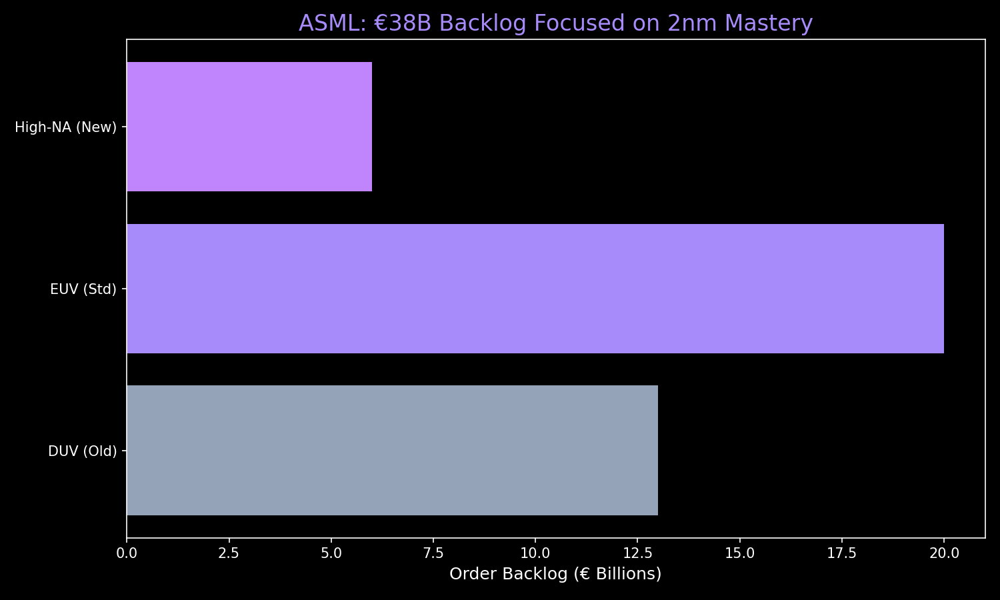

# 🔬 Investment Thesis: ASML (ASML)
**Theme:** Sovereign Tech / EUV Monopoly
**Horizon:** 5-7 Years | **Rating:** The Crown Jewel

---

## 📊 Performance Visual: The 2nm Backlog
ASML owns the most important bottleneck in the world: The ability to print 2nm and 1.4nm chips.

---

## 💡 The Core Thesis
ASML is the **most important company in the modern world.** It holds a 100% monopoly on the EUV (Extreme Ultraviolet) lithography machines required to make advanced AI chips.

### **Key Value Drivers**
1.  **The 2nm Supercycle:** 2026 is the year of the 2nm ramp-up. TSMC, Samsung, and Intel are all fully booked, guaranteeing high utilization for ASML's fleet.
2.  **The "Silicon Shield":** In a world of geopolitical conflict, "Silicon Independence" is a national security priority. ASML is the only provider of the tools required for the US and Europe to build their own fabs.
3.  **Financial Fortress:** €38B backlog and 53% gross margins. ASML is "High-Margin Atoms" that scales with the AI revolution.

---

## 🔬 Your Cushion: $703 Entry
*   **Strategy:** You are up **+83%**. You are "the house" in this trade.
*   **Monday Outlook:** Ignore the tech-selloff noise. ASML is essential infrastructure, not a speculative growth stock.

---

## 📉 Tactical Guidance
*   **Action:** **STICK.** This is a multi-decade hold.
*   **Structural Stop:** $990 (200-day Moving Average).
*   **12-Month Target:** $1,460.00

---
*Generated for the Private AI OS & bull; March 2026*
