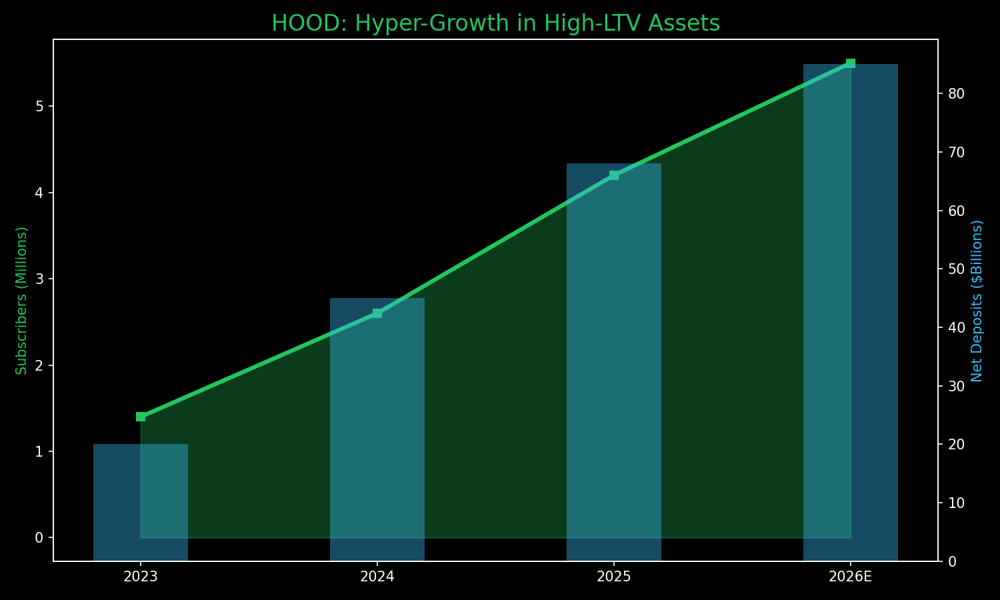

# 🏹 Investment Thesis: Robinhood (HOOD)
**Theme:** Next-Gen Financial SuperApp / Wealth Migration
**Horizon:** 5-7 Years | **Rating:** Growth Alpha

---

## 📊 Performance Visual: The Asset Magnet
HOOD is successfully converting "traders" into "long-term investors" via Gold and Retirement matches.

---

## 💡 The Core Thesis
Robinhood is the primary beneficiary of the **$100 Trillion generational wealth transfer.** It has successfully pivoted from a "meme app" into a comprehensive financial OS for Millennials and Gen Z.

### **Key Value Drivers**
1.  **Massive Net Deposits:** $68 Billion in net deposits in 2025 (35% growth) confirms that "serious money" is moving to the platform.
2.  **The "Gold" Lock-In:** 4.2M subscribers (+58% YoY). The 3% IRA match creates a **5-year retention moat** that legacy firms cannot easily match without destroying their own margins.
3.  **Product Velocity:** The Gold Card ($10B annual spend) and the new Platinum tier transform HOOD into a daily-use utility, increasing ARPU ($191).
4.  **Operating Leverage:** Record 2025 net income ($1.9B) proves the model scales.

---

## 🔬 Competitive Moat
*   **The "Graduation" Solution:** By acquiring TradePMR (RIA network), HOOD now retains users as they grow into high-net-worth individuals, removing its greatest historical weakness.
*   **Demographic Monopoly:** HOOD owns the mobile-first interface that defines the financial expectations of the next 30 years of investors.

---

## 📉 Tactical Guidance
*   **Target Entry Zone:** $68 - $72 (Patience required; let the "Monday Bloodbath" flush out the leverage).
*   **Structural Role:** High-Beta Growth Alpha.
*   **12-Month Target:** $120.00

---
*Generated for the Private AI OS & bull; March 2026*
