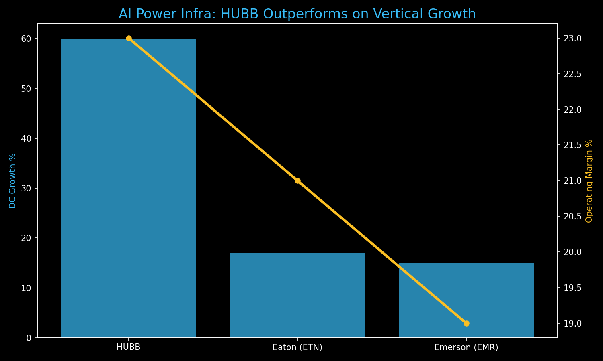

# 🏗️ Investment Thesis: Hubbell Inc. (HUBB)
**Theme:** AI Grid Infrastructure / "Atoms" of Power
**Horizon:** 5-7 Years | **Rating:** Defensive Alpha

---

## 📊 Performance Visual: The Power Bottleneck
HUBB is outperforming traditional industrials by focusing on the highest-growth vertical: **Data Center Interconnects.**

---

## 💡 The Core Thesis
AI scaling is hitting a physical wall: **Power.** Hubbell manufactures the "picks and shovels" (connectors, transformers, and enclosures) required to bridge data centers to an aging U.S. electrical grid.

### **Key Value Drivers**
1.  **The $2.8T Grid Upgrade:** The US grid is 50+ years old. HUBB owns the "interconnection point," the ultimate gatekeeper for new AI power capacity.
2.  **Hyper-Growth (60% YoY):** Data center revenue surged 60% in Q4 2025. Unlike software, this is "nondiscretionary" CapEx—hyperscalers *must* buy this to turn on their chips.
3.  **Pricing Power:** HUBB builds mission-critical components where failure leads to catastrophic downtime, allowing for sustained **23% operating margins.**

---

## 🔬 Sector Comparison: Why HUBB?
*   **vs. Eaton (ETN):** HUBB is more specialized in the utility-scale grid interface, whereas Eaton is broader. HUBB offers higher "pure-play" beta to the grid hardening cycle.
*   **vs. Emerson (EMR):** Emerson is software-heavy; HUBB is the physical "Atoms" layer. In a war/oil shock, the physical grid hardening takes priority.

---

## 📉 Tactical Guidance
*   **Target Entry Zone:** $470 - $475 (Watch for Relative Strength during the bloodbath).
*   **Structural Role:** Defensive Alpha. Provides a volatility floor.
*   **12-Month Target:** $650.00

---
*Generated for the Private AI OS & bull; March 2026*
