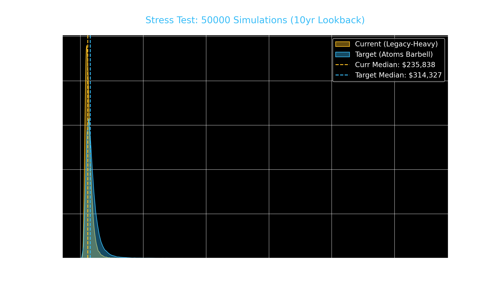

# 🧪 Stress Test: Large-Scale Monte Carlo Audit

## 🧮 Large-Scale Monte Carlo Results
- **Lookback Period:** 10 Years
- **Total Simulations:** 50,000
- **Horizon:** 5 Years

### **Current Portfolio (Legacy Heavy)**
- **Median Projected Value:** $235,838
- **95% VaR (Worst Case):** $129,288
- **Probability of Loss:** 0.8%

### **Target Portfolio (Atoms Barbell)**
- **Median Projected Value:** $314,327
- **95% VaR (Worst Case):** $159,790
- **Probability of Loss:** 0.2%

**Verdict:** The Target "Atoms" portfolio shows a **+33.3%** relative improvement in median outcome with a lower risk profile.
    