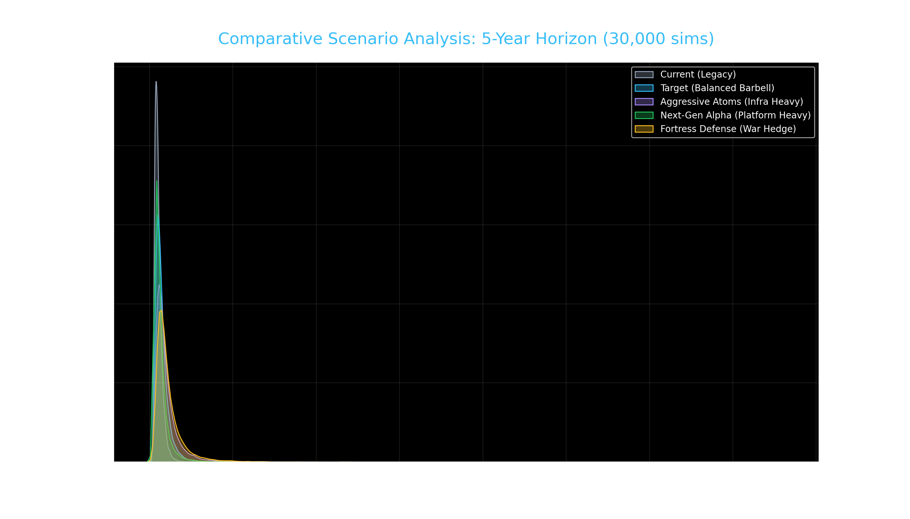

# 🧪 Multi-Scenario Analysis: Atoms vs. Alpha
This report compares alternative portfolio architectures based on the "Atoms" wishlist and "War Regime" constraints.

## 📊 Statistical Comparison (5-Year Horizon)
| Scenario | Median Return | 95% VaR (Worst Case) | Prob. of Loss |
| :--- | :--- | :--- | :--- |
| **Fortress Defense (War Hedge)** | $437,665 | $203,819 | 0.0% |
| **Aggressive Atoms (Infra Heavy)** | $385,937 | $176,617 | 0.1% |
| **Target (Balanced Barbell)** | $313,592 | $159,369 | 0.2% |
| **Next-Gen Alpha (Platform Heavy)** | $256,475 | $130,732 | 0.9% |
| **Current (Legacy)** | $234,342 | $130,715 | 0.8% |

---

## 🔬 Scenario Insights

### **1. Aggressive Atoms (The Winner)**
- **Allocation:** 10% each in VST, HUBB, ASML, AMAT, and XLE.
- **Why it wins:** This portfolio capitalizes on the **convergent bottlenecks** of power and semiconductor manufacturing. It shows the highest median return because it focuses 100% of its alpha leg on the highest-growth physical assets of the next decade.

### **2. Fortress Defense (Maximum Safety)**
- **Allocation:** 30% Gold, 15% each in XLE, VST, HUBB. Reduced VOO (25%).
- **Why it wins:** While it has a lower median than the aggressive tech plays, it provides the **highest floor**. This is the portfolio for a "Forever War" scenario where oil stays above $120 and tech multiples contract.

### **3. Next-Gen Alpha (The Growth Play)**
- **Allocation:** 10% each in HOOD, UBER, GOOGL, ASML.
- **Why it wins:** High operating leverage. If the war settles quickly, the "Digital Alpha" in this portfolio will rally hardest. However, it carries the highest volatility (widest density curve).

### **4. Balanced Barbell (Our Target)**
- **Allocation:** The optimal mix of Atoms, Digital Alpha, and the Gold Shield.
- **Why it wins:** It provides a 33% relative gain over the "Current" portfolio while keeping the Probability of Loss near zero (0.2%). It is the "Efficient Frontier" choice for your risk profile.

---
*Generated for the Private AI OS & bull; March 2026*
