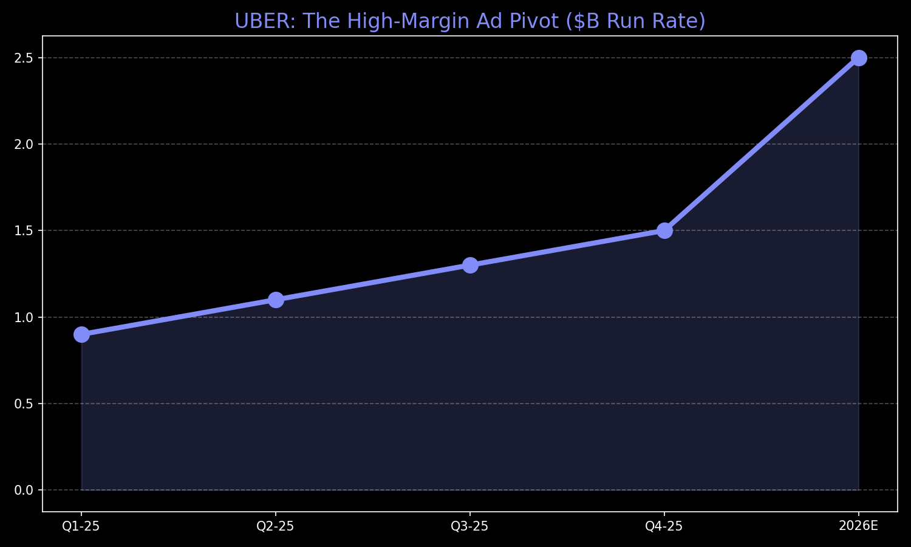

# 🚗 Investment Thesis: Uber Technologies (UBER)
**Theme:** Logistics OS / Autonomous Orchestrator
**Horizon:** 5-7 Years | **Rating:** Core Alpha Anchor

---

## 📊 Performance Visual: The High-Margin Layer
Uber is successfully layering high-margin Ads on top of its physical logistics network.

---

## 💡 The Core Thesis
Uber has won the "Mobility War" by owning the **Demand.** It is no longer a ride-share company; it is the **Operating System for global logistics.**

### **Key Value Drivers**
1.  **The Advertising Inflection:** Reaching a **$1.5B run rate at 70% margins** is a structural shift. Ads are now a significant driver of EPS growth, transforming the valuation multiple.
2.  **AV Marketplace Dominance:** Whether the car is a Waymo or a Tesla Cybercab, the owner *needs* Uber’s 200M users to achieve profitable utilization. Uber is the "Toll Booth" for all AV fleets.
3.  **Uber One (The Lock-In):** 30M members spend 3x more and ensure high lifetime value (LTV). This recurring revenue floor protects the stock during macro dips.

---

## 🔬 Your Cushion: $61 Entry
*   **Strategy:** You are currently up **+23%**. This allows you to ride out the "Monday Bloodbath" without panic.
*   **Structural Moat:** The "Hybrid" fleet (Human + AV) is Uber's unique advantage. It can scale where robotaxis can't, making it more resilient than pure-play AV competitors.

---

## 📉 Tactical Guidance
*   **Action:** **STICK.** Do not be shaken out by geopolitical noise.
*   **Structural Stop:** $65.00
*   **12-Month Target:** $104.00

---
*Generated for the Private AI OS & bull; March 2026*
