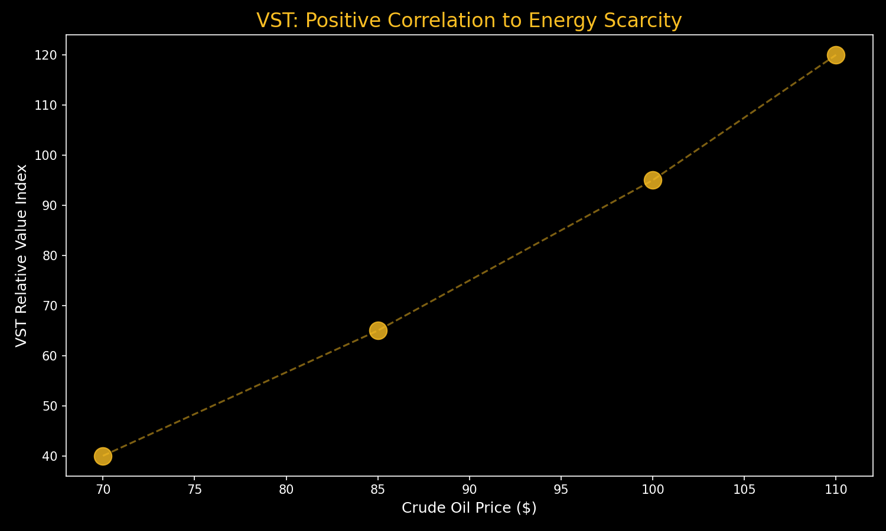

# ⚡ Investment Thesis: Vistra Corp (VST)
**Theme:** Nuclear Renaissance / Energy Autonomy
**Horizon:** 5-7 Years | **Rating:** Regime Alpha

---

## 📊 Performance Visual: The Energy Hedge
VST acts as a "Positive Carry" hedge; its value index correlates directly with global energy scarcity.

---

## 💡 The Core Thesis
In a world of $100+ oil and a protracted US-Iran war, **Sovereign Energy** is the ultimate Alpha. VST is the leading "Atoms" play on the decoupling from Middle Eastern energy dependencies.

### **Key Value Drivers**
1.  **The Nuclear Anchor:** VST owns one of the largest nuclear fleets in the US. This is the only 24/7 carbon-free power source capable of meeting AI hyperscaler demand (Meta/Amazon).
2.  **Merchant Power Exposure:** Unlike regulated utilities, VST can sell power at market rates. In an oil shock, electricity prices spike, leading to massive windfall profits for VST.
3.  **Capital Efficiency:** Aggressive $5.6B share buyback program and raised 2026 EBITDA guidance ($6.8B+) make it a "shareholder-first" utility.

---

## 🔬 Strategic Role in the "Barbell"
*   **The War Hedge:** VST provides the protection of a commodity (oil) but with the growth of a tech stock (AI data centers).
*   **The "Atoms" Synergy:** VST provides the power that your other holdings (**ASML, AMAT, HUBB**) require to function.

---

## 📉 Tactical Guidance
*   **Target Entry:** Immediate (War Shield).
*   **Structural Role:** Regime Alpha.
*   **Stop Loss:** 15% Trailing.

---
*Generated for the Private AI OS & bull; March 2026*
