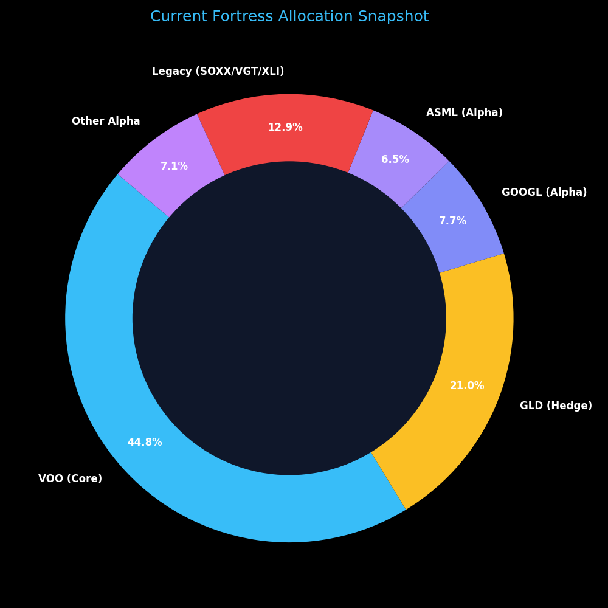
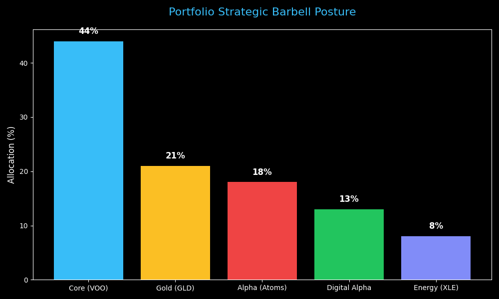
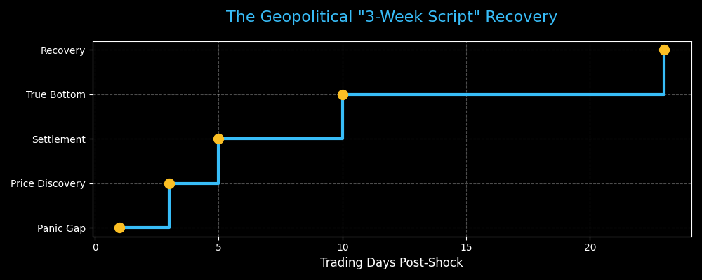
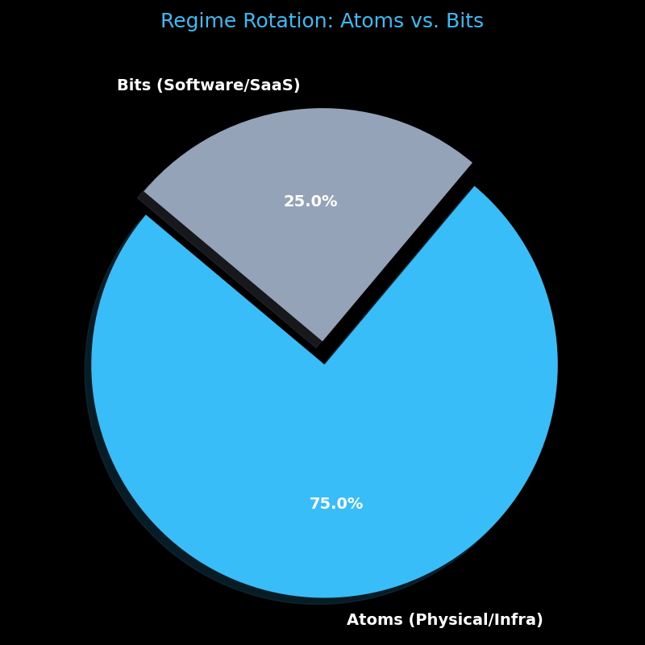

# 🏰 Fortress Barbell: War Regime Strategy Report
**Date:** March 8, 2026
**Market Regime:** US-Iran War / "Atoms" Rotation
**Sentiment:**  

---

## 🏛️ Visual 0: Current Portfolio Allocation
This is your actual starting point heading into the Monday Bloodbath.

### **The "Strategic Drag" Audit**
*   **Core Anchor (44.8%)**: VOO provides market beta. No action needed.
*   **The Hedge (21.0%)**: GLD is your primary insurance. It handles the "War Shock" so you don't have to panic-sell tech.
*   **The Alpha Sleeve (14.2%+)**: ASML and GOOGL are your high-conviction anchors. ASML ($703 entry) is your strongest asset.
*   **The Legacy Drag (~13.0%)**: SOXX, VGT, and XLI represent the capital available for the **"Atoms Rotation."** These are the "funding sources" for your wishlist picks.

---

## 📊 Visual 1: The Strategic Barbell Posture
This chart maps how your portfolio is architected to survive the US-Iran war shock.

---

## 📋 Portfolio Audit & War Resilience

| Ticker | Theme | Cushion | Action |
| :--- | :--- | :--- | :--- |
| **ASML** | Atoms / EUV monopoly | **+83%** | **STICK.** Do not sell the monopoly. |
| **UBER** | Logistics OS / AV | **+23%** | **STICK.** Structural Stop @ $65. |
| **AMAT** | Foundry Supercycle | **+5%** | **HOLD.** Expand on dips once settled. |
| **VOO** | Core market engine | **BETA** | **RIDE.** Market Engine. |

---

## 📈 Visual 2: The "3-Week Script" (Historical Timeline)
Based on 1990 and 2022 data, this is the expected sequence of the market recovery.

---

## 🔬 Validated Wishlist (5-7 Year Alpha)

| Ticker | Theme | Probability | Target / Action |
| :--- | :--- | :--- | :--- |
| **⚡ VST** | **Nuclear Power** | **9.0** | **Target: 4% Weight.** Energy Autonomy. |
| **🏗️ HUBB** | **Grid Infrastructure** | **8.0** | **Target Zone: $470 - $475.** AI Power. |
| **🏹 HOOD** | **Next-Gen Finance** | **8.5** | **Wait for: $68 - $72.** Wealth Migration. |

---

## 🔄 Visual 3: The Regime Rotation Meter
The market is currently shifting heavily from Software/Growth to Physical/Infrastructure.

---

## 🚀 Final "Monday & Beyond" Plan

1.  **Phase 1 (Settlement):** Wait 48-72 hours for price discovery. Ignore the Monday morning gap.
2.  **Phase 2 (Accumulation):** Identify **Relative Strength** (stocks that stop falling first).
3.  **Phase 3 (Rebalance):** Use CIBR cash to fill the **0% Energy (XLE)** gap and start the **VST/HUBB** entries.

**Strategic Verdict:** TRUST THE ARMOR. WATCH FOR THE BASE.
